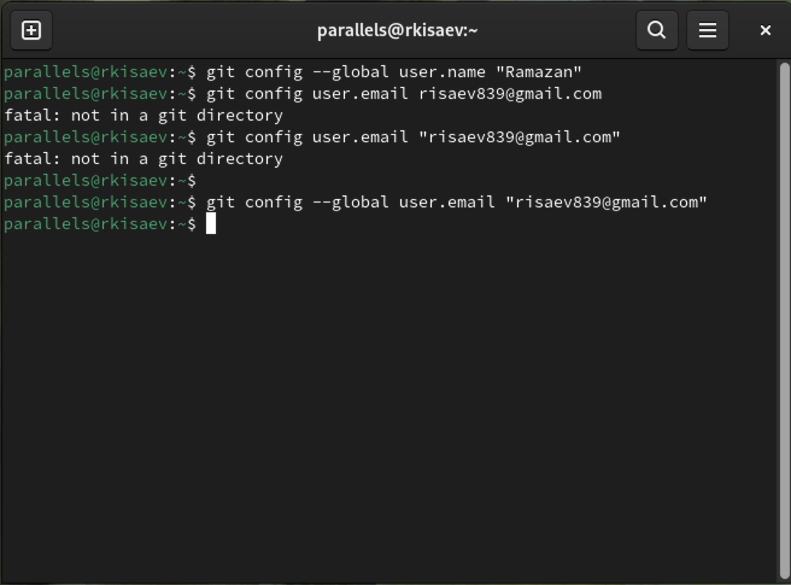
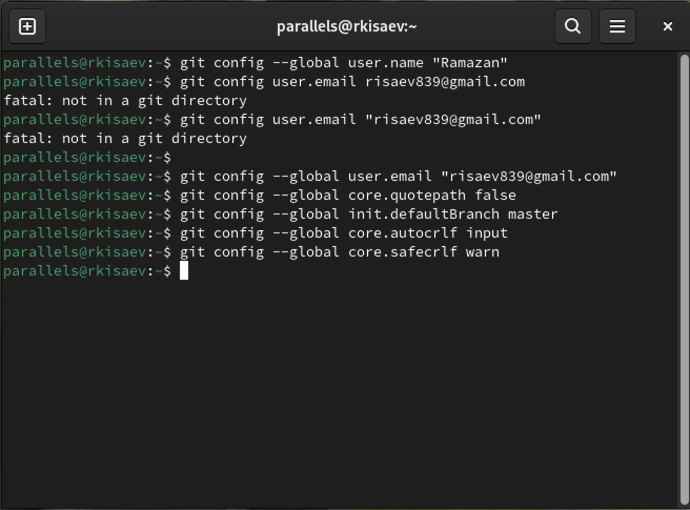
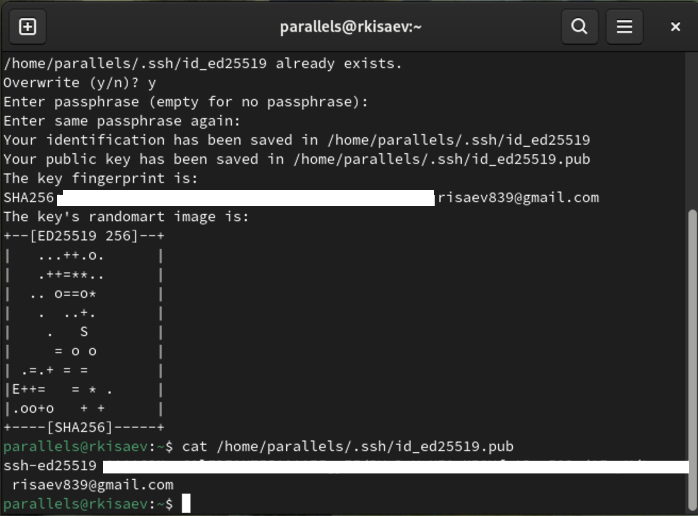
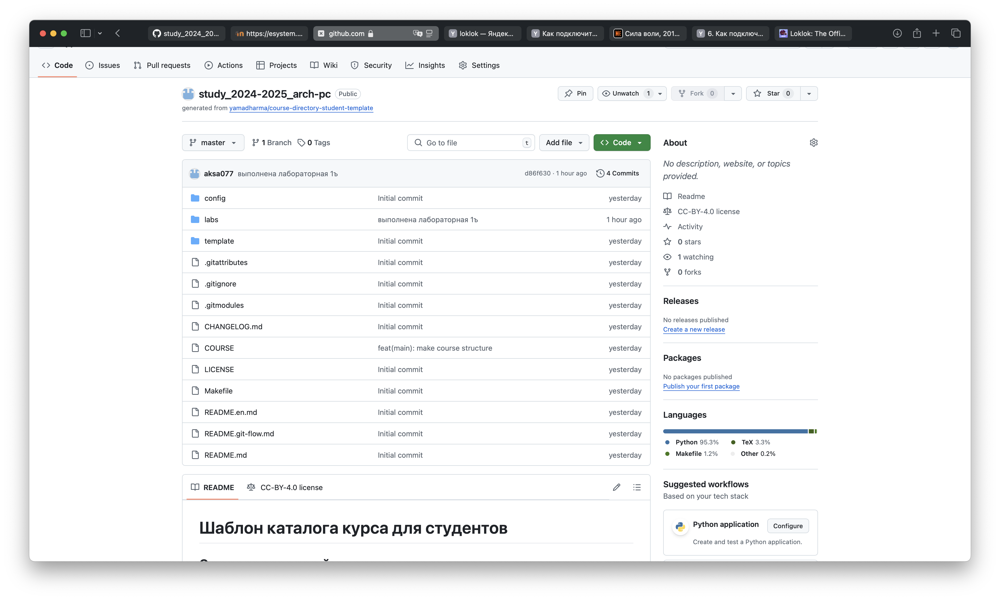
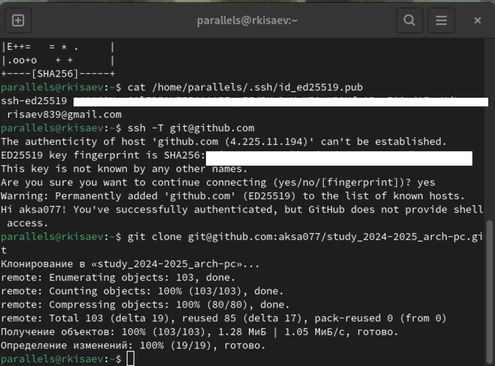
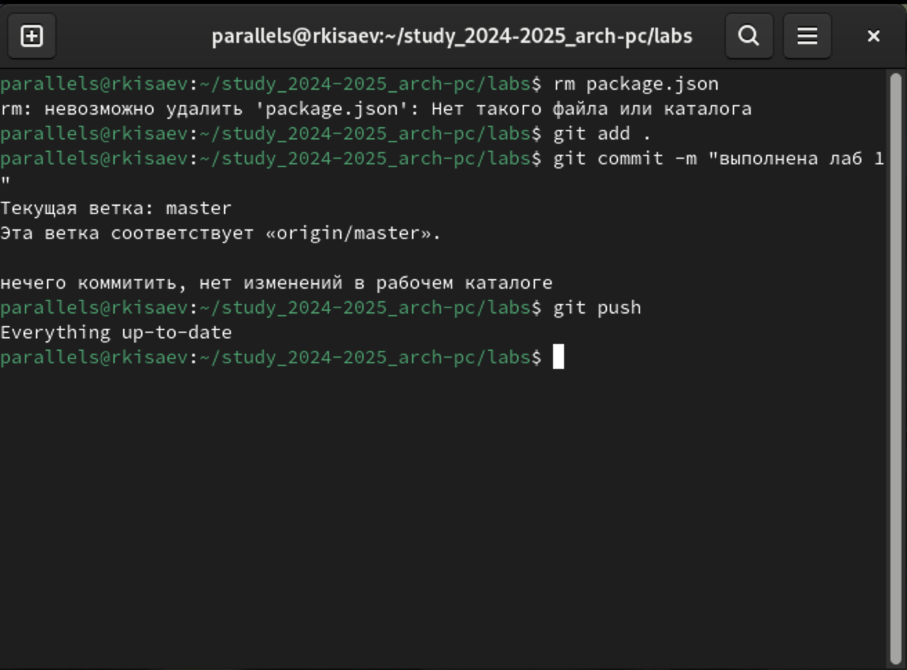
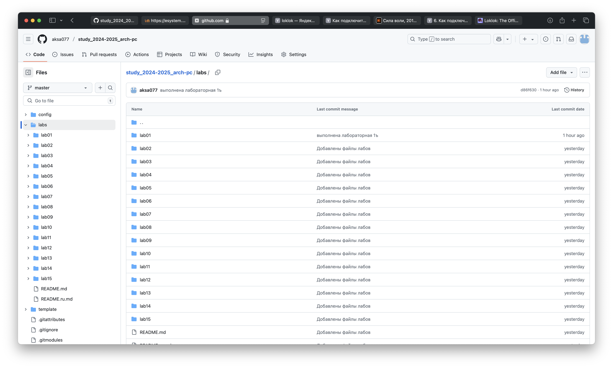

---
## Front matter
title: " отчёт по лабораторной работе"
author: "Исаев Рамазан Курбанович"

## Generic otions
lang: ru-RU
toc-title: "Содержание"

## Bibliography
bibliography: bib/cite.bib
csl: pandoc/csl/gost-r-7-0-5-2008-numeric.csl

## Pdf output format
toc: true # Table of contents
toc-depth: 2
lof: true # List of figures
lot: true # List of tables
fontsize: 12pt
linestretch: 1.5
papersize: a4
documentclass: scrreprt
## I18n polyglossia
polyglossia-lang:
  name: russian
  options:
	- spelling=modern
	- babelshorthands=true
polyglossia-otherlangs:
  name: english
## I18n babel
babel-lang: russian
babel-otherlangs: english
## Fonts
mainfont: IBM Plex Serif
romanfont: IBM Plex Serif
sansfont: IBM Plex Sans
monofont: IBM Plex Mono
mathfont: STIX Two Math
mainfontoptions: Ligatures=Common,Ligatures=TeX,Scale=0.94
romanfontoptions: Ligatures=Common,Ligatures=TeX,Scale=0.94
sansfontoptions: Ligatures=Common,Ligatures=TeX,Scale=MatchLowercase,Scale=0.94
monofontoptions: Scale=MatchLowercase,Scale=0.94,FakeStretch=0.9
mathfontoptions:
## Biblatex
biblatex: true
biblio-style: "gost-numeric"
biblatexoptions:
  - parentracker=true
  - backend=biber
  - hyperref=auto
  - language=auto
  - autolang=other*
  - citestyle=gost-numeric
## Pandoc-crossref LaTeX customization
figureTitle: "Рис."
tableTitle: "Таблица"
listingTitle: "Листинг"
lofTitle: "Список иллюстраций"
lotTitle: "Список таблиц"
lolTitle: "Листинги"
## Misc options
indent: true
header-includes:
  - \usepackage{indentfirst}
  - \usepackage{float} # keep figures where there are in the text
  - \floatplacement{figure}{H} # keep figures where there are in the text
---

# Цель работы
Целью работы является изучить идеологию и применение системы контроля 
версий. Приобрести практические навыки по работе с системой git. 

# Задание

На основе методических указаний провести работу с базовыми командами 
системы контроля версий git, выучить применение команд для разных случаев 
использования, настроить GitHubНа основе методических указаний провести работу с базовыми командами 
системы контроля версий git, выучить применение команд для разных случаев 
использования, настроить GitHub

# Теоретическое введение

Системы контроля версий (Version Control System, VCS) применяются при 
работе нескольких человек над одним проектом. Обычно основное дерево проекта 
хранится в локальном или удалённом репозитории, к которому настроен доступ для 
участников проекта. При внесении изменений в содержание проекта система контроля 
версий позволяет их фиксировать, совмещать изменения, произведённые разными 
участниками проекта, производить откат к любой более ранней версии проекта, если 
это требуется. В классических системах контроля версий используется 
централизованная модель, предполагающая наличие единого репозитория для 
хранения файлов. Выполнение большинства функций по управлению версиями 
осуществляется специальным сервером. Участник проекта (пользователь) перед 
началом работы посредством определённых команд получает нужную ему версию 
файлов. После внесения изменений, пользователь размещает новую версию в 
хранилище. При этом предыдущие версии не удаляются из центрального хранилища и 
к ним можно вернуться в любой момент. Сервер может сохранять не полную версию 
изменённых файлов, а производить так называемую дельта-компрессию — сохранять 
только изменения между последовательными версиями, что позволяет уменьшить 
объём хранимых данных. Системы контроля версий поддерживают возможность 
отслеживания и разрешения конфликтов, которые могут возникнуть при работе 
нескольких человек над одним файлом. Можно объединить (слить) изменения, 
сделанные разными участниками (автоматически или вручную), вручную выбрать 
нужную версию, отменить изменения вовсе или заблокировать файлы для изменения. 
В зависимости от настроек блокировка не позволяет другим пользователям получить 
рабочую копию или препятствует изменению рабочей копии файла средствами 
файловой системы ОС, обеспечивая таким образом, привилегированный доступ 
только одному пользователю, работающему с файлом.

# Выполнение лабораторной работы

## Техническое обеспечение 

Лабораторная работа была выполнена на домашнем компьютере под 
управлением операционной системы Fedora Workstation 40. 

## Базовая настройка Git 
Для начала я проведу предварительную конфигурацию Git, для этого открываю 
терминал и ввожу команды на (рис 1)

{#fig:001 width=70%}

Далее настраиваю параметры utf-8, имя начальной ветки, autocrlf и safecrlf (рис. 2) 

## Настройка параметров utf-8

{#fig:002 width=70%}

Далее создаю пару ssh ключей для интеграции с платформой GitHub (рис. 3) 

## Создание ключей

{#fig:003 width=70%}

Ключ добавлен (рис. 4)

{#fig:004 width=70%}

## Создание репозитория

Репозиторий у меня был создан (рис 5)

{#fig:005 width=70%}

##

Копирование репозитория на рабочую среду (рис 6)

{#fig:006 width=70%}

Далее я удалил файлы package.json, настроил каталог курса и отправил изменения на удаленный репозиторий (рис 7)

##

{#fig:007 width=70%}

{#fig:008 width=70%}

# Выводы 
 
При выполнении данной лабораторной работы я изучил идеологию и 
применение средств контроля версий, а также приобрел практические навыки по 
работе с реализацией VSC git.

# Список литературы 

GDB: The GNU Project Debugger. — URL: https://www.gnu.org/software/gdb/.
GNU Bash Manual. — 2016. — URL: https://www.gnu.org/software/bash/manual/.
Midnight Commander Development Center. — 2021. — URL: https://midnight-commander.
org/.
NASM Assembly Language Tutorials. — 2021. — URL: https://asmtutor.com/.
Newham C. Learning the bash Shell: Unix Shell Programming. — O’Reilly Media, 2005. —
354 с. — (In a Nutshell). — ISBN 0596009658. — URL: http://www.amazon.com/Learning-
bash-Shell-Programming-Nutshell/dp/0596009658.
Robbins A. Bash Pocket Reference. — O’Reilly Media, 2016. — 156 с. — ISBN 978-1491941591.
The NASM documentation. — 2021. — URL: https://www.nasm.us/docs.php.
Zarrelli G. Mastering Bash. — Packt Publishing, 2017. — 502 с. — ISBN 9781784396879.
Колдаев В. Д., Лупин С. А. Архитектура ЭВМ. — М. : Форум, 2018.
Куляс О. Л., Никитин К. А. Курс программирования на ASSEMBLER. — М. : Солон-Пресс,
2017.
Новожилов О. П. Архитектура ЭВМ и систем. — М. : Юрайт, 2016.
Расширенный ассемблер: NASM. — 2021. — URL: https://www.opennet.ru/docs/RUS/nasm/.
Робачевский А., Немнюгин С., Стесик О. Операционная система UNIX. — 2-е изд. — БХВ-
Петербург, 2010. — 656 с. — ISBN 978-5-94157-538-1.
Столяров А. Программирование на языке ассемблера NASM для ОС Unix. — 2-е изд. —
М. : МАКС Пресс, 2011. — URL: http://www.stolyarov.info/books/asm_unix.
Таненбаум Э. Архитектура компьютера. — 6-е изд. — СПб. : Питер, 2013. — 874 с. —
(Классика Computer Science).
Таненбаум Э., Бос Х. Современные операционные системы. — 4-е изд. — СПб. : Питер,
2015. — 1120 с. — (Классика Computer Science).
