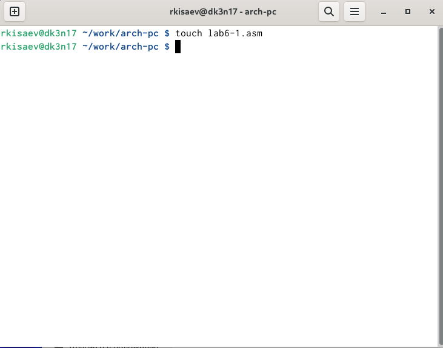
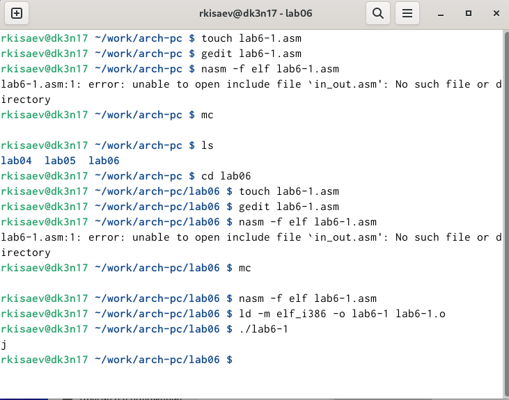
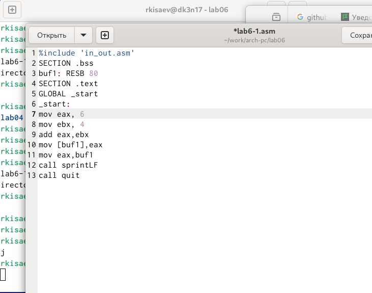
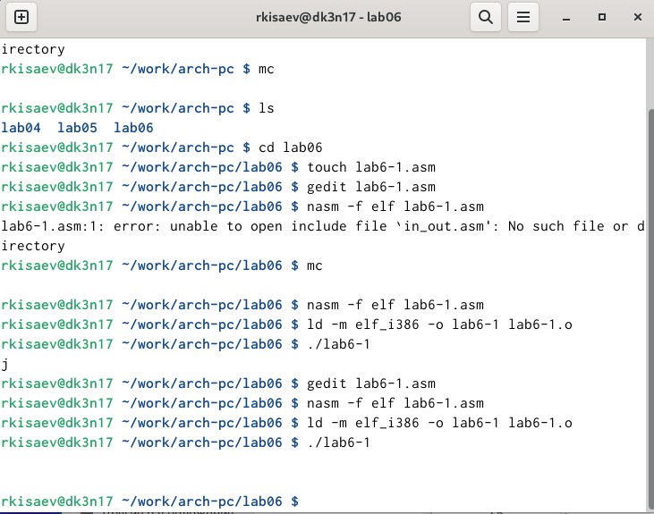
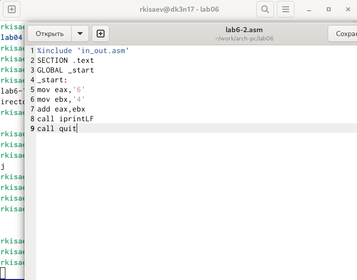
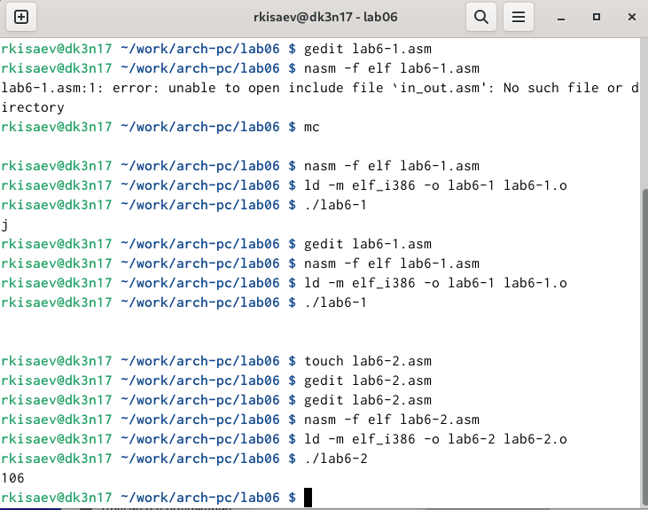
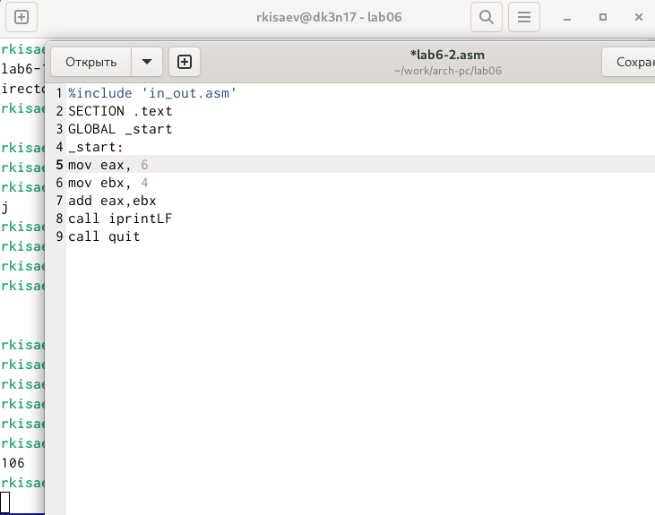

---
## Front matter
title: "Отчет по лабораторной работе 6"
author: "Исаев Рамазан Курбанович"

## Generic otions
lang: ru-RU
toc-title: "Содержание"

## Bibliography
bibliography: bib/cite.bib
csl: pandoc/csl/gost-r-7-0-5-2008-numeric.csl

## Pdf output format
toc: true # Table of contents
toc-depth: 2
lof: true # List of figures
lot: true # List of tables
fontsize: 12pt
linestretch: 1.5
papersize: a4
documentclass: scrreprt
## I18n polyglossia
polyglossia-lang:
  name: russian
  options:
	- spelling=modern
	- babelshorthands=true
polyglossia-otherlangs:
  name: english
## I18n babel
babel-lang: russian
babel-otherlangs: english
## Fonts
mainfont: IBM Plex Serif
romanfont: IBM Plex Serif
sansfont: IBM Plex Sans
monofont: IBM Plex Mono
mathfont: STIX Two Math
mainfontoptions: Ligatures=Common,Ligatures=TeX,Scale=0.94
romanfontoptions: Ligatures=Common,Ligatures=TeX,Scale=0.94
sansfontoptions: Ligatures=Common,Ligatures=TeX,Scale=MatchLowercase,Scale=0.94
monofontoptions: Scale=MatchLowercase,Scale=0.94,FakeStretch=0.9
mathfontoptions:
## Biblatex
biblatex: true
biblio-style: "gost-numeric"
biblatexoptions:
  - parentracker=true
  - backend=biber
  - hyperref=auto
  - language=auto
  - autolang=other*
  - citestyle=gost-numeric
## Pandoc-crossref LaTeX customization
figureTitle: "Рис."
tableTitle: "Таблица"
listingTitle: "Листинг"
lofTitle: "Список иллюстраций"
lotTitle: "Список таблиц"
lolTitle: "Листинги"
## Misc options
indent: true
header-includes:
  - \usepackage{indentfirst}
  - \usepackage{float} # keep figures where there are in the text
  - \floatplacement{figure}{H} # keep figures where there are in the text
---

# Цель работы

Цель данной лабораторной работы - освоение арифметческих инструкций языка ассемблера NASM.

# Задание

Символьные и численные данные в NASM
Выполнение арифметических операций в NASM
Выполнение заданий для самостоятельной работы

# Теоретическое введение

Большинство инструкций на языке ассемблера требуют обработки операндов. Адрес операнда предоставляет место, где хранятся данные, подлежащие обработке. Это могут быть данные хранящиеся в регистре или в ячейке памяти. - Регистровая адресация – операнды хранятся в регистрах и в команде используются имена этих регистров, например: mov ax,bx. - Непосредственная адресация – значение операнда задается непосредственно в команде, Например: mov ax,2.

Адресация памяти – операнд задает адрес в памяти. В команде указывается символическое обозначение ячейки памяти, над содержимым которой требуется выполнить операцию. Ввод информации с клавиатуры и вывод её на экран осуществляется в символьном виде. Кодирование этой информации производится согласно кодовой таблице символов ASCII. ASCII – сокращение от American Standard Code for Information Interchange (Американский стандартный код для обмена информацией). Согласно стандарту ASCII каждый символ кодируется одним байтом. Среди инструкций NASM нет такой, которая выводит числа (не в символьном виде). Поэтому, например, чтобы вывести число, надо предварительно преобразовать его цифры в ASCII-коды этих цифр и выводить на экран эти коды, а не само число. Если же выводить число на экран непосредственно, то экран воспримет его не как число, а как последовательность ASCII-символов – каждый байт числа будет воспринят как один ASCII-символ – и выведет на экран эти символы. Аналогичная ситуация происходит и при вводе данных с клавиатуры. Введенные данные будут представлять собой символы, что сделает невозможным получение корректного результата при выполнении над ними арифметических операций. Для решения этой проблемы необходимо проводить преобразование ASCII символов в числа и обратно.

# Выполнение лабораторной работы

## Символьные и численные данные в NASM 

Создаю каталог для программ лабораторной работы №6 и перехожу в него, создаю там файл

{#fig:001 width=70%}

Создаю исполняемый файл и запускаю его, вывод программы отличается от предполагаемого изначально, ибо коды символов в сумме дают символ j по таблице ASCII.

{#fig:002 width=70%}

#

{#fig:003 width=70%}

На этот раз программа выдала пустую строчку, это связано с тем, что символ 10 означает переход на новую строк

{#fig:004 width=70%}

#

Создаю новый файл для будущей программы и записываю в нее код из листинга

{#fig:005 width=70%}

Создаю исполняемый файл и запускаю его, теперь отображается результат 106, программа, как и в первый раз, сложила коды символов, но вывела само число, а не его символ, благодяря замене функции вывода на iprintLF

{#fig:006 width=70%}

#

Убрав кавычки в программе, я снова ее запускаю и получаю предполагаемый изначально результат. (рис. -@fig:008).

{#fig:007 width=70%}

{#fig:008 width=70%}

#

{#fig:009 width=70%}

{#fig:010 width=70%}

## Выполнение арифметических операций в NASM

Программа выполняет арифметические вычисления, на вывод идет результирующее выражения и его остаток от деления 

{#fig:011 width=70%}

Запуск программы дает корректный результат

{#fig:012 width=70%}

## Задание для самостоятельной работы

В соответсвии с выбранным вариантом, я реализую программу для подсчета функции f(x) = 10(𝑥 + 1) − 10, проверка на нескольких переменных показывает корректное выполнение программы

{#fig:013 width=70%}

# Выводы

При выполнении данной лабораторной работы я освоил арифметические инструкции языка ассемблера NASM.

# Контрольные вопросы

1. За вывод сообщения “Ваш вариант” отвечают строки кода:
mov eax,rem
call sprint

2. Инструкция mov ecx, x используется, чтобы положить адрес вводимой строки x в регистр ecx mov edx, 80 - запись в регистр edx длины вводимой строки call sread - вызов подпрограммы из внешнего файла, обеспечивающей ввод сообщения с клавиатуры.

3. call atoi используется для вызова подпрограммы из внешнего файла, которая преобразует ascii-код символа в целое число и записывает результат в регистр eax.

4. За вычисления варианта отвечают строки:

xor edx,edx ; обнуление edx для корректной работы div
mov ebx,20 ; ebx = 20
div ebx ; eax = eax/20, edx - остаток от деления
inc edx ; edx = edx + 1

5. При выполнении инструкции div ebx остаток от деления записывается в регистр edx.

6. Инструкция inc edx увеличивает значение регистра edx на 1.

7. За вывод на экран результатов вычислений отвечают строки:

mov eax,edx
call iprintLF

