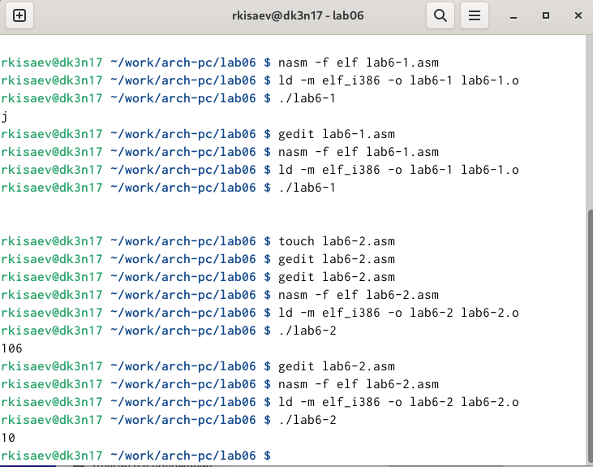
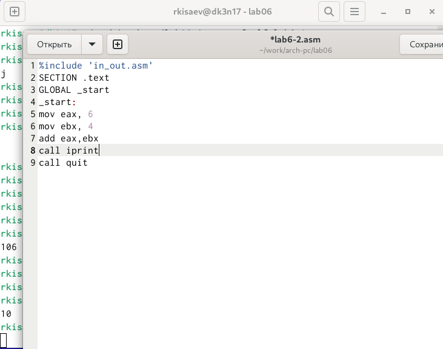
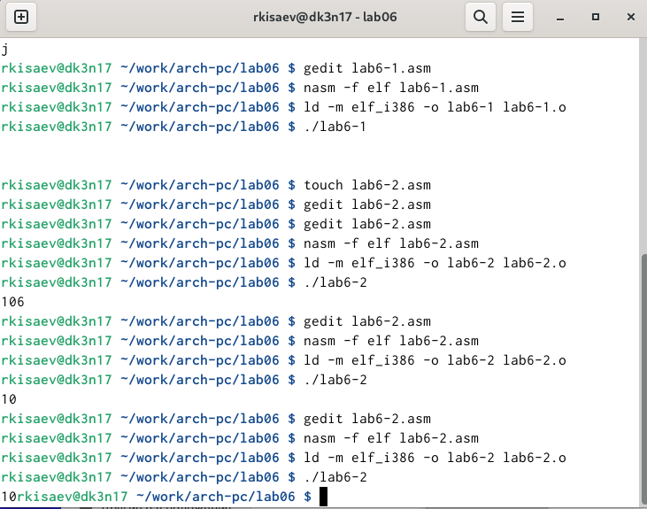
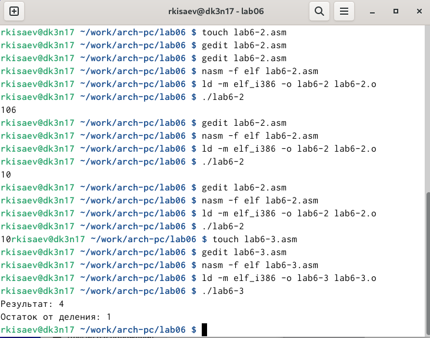
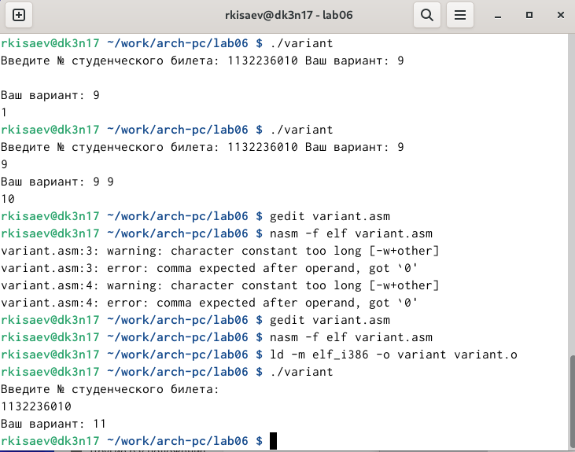
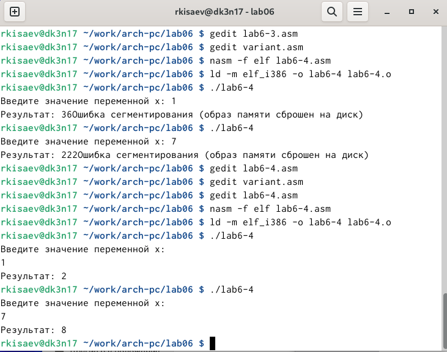

---
## Front matter
title: "Отчет по лабораторной работе 6"
author: "Исаев Рамазан Курбанович"

## Generic otions
lang: ru-RU
toc-title: "Содержание"

## Bibliography
bibliography: bib/cite.bib
csl: pandoc/csl/gost-r-7-0-5-2008-numeric.csl

## Pdf output format
toc: true # Table of contents
toc-depth: 2
lof: true # List of figures
lot: true # List of tables
fontsize: 12pt
linestretch: 1.5
papersize: a4
documentclass: scrreprt
## I18n polyglossia
polyglossia-lang:
  name: russian
  options:
	- spelling=modern
	- babelshorthands=true
polyglossia-otherlangs:
  name: english
## I18n babel
babel-lang: russian
babel-otherlangs: english
## Fonts
mainfont: IBM Plex Serif
romanfont: IBM Plex Serif
sansfont: IBM Plex Sans
monofont: IBM Plex Mono
mathfont: STIX Two Math
mainfontoptions: Ligatures=Common,Ligatures=TeX,Scale=0.94
romanfontoptions: Ligatures=Common,Ligatures=TeX,Scale=0.94
sansfontoptions: Ligatures=Common,Ligatures=TeX,Scale=MatchLowercase,Scale=0.94
monofontoptions: Scale=MatchLowercase,Scale=0.94,FakeStretch=0.9
mathfontoptions:
## Biblatex
biblatex: true
biblio-style: "gost-numeric"
biblatexoptions:
  - parentracker=true
  - backend=biber
  - hyperref=auto
  - language=auto
  - autolang=other*
  - citestyle=gost-numeric
## Pandoc-crossref LaTeX customization
figureTitle: "Рис."
tableTitle: "Таблица"
listingTitle: "Листинг"
lofTitle: "Список иллюстраций"
lotTitle: "Список таблиц"
lolTitle: "Листинги"
## Misc options
indent: true
header-includes:
  - \usepackage{indentfirst}
  - \usepackage{float} # keep figures where there are in the text
  - \floatplacement{figure}{H} # keep figures where there are in the text
---

# Цель работы

Приобретение практических навыков взаимодействия пользователя с системой командной строки 

# Задание

1. Определить полное имя домашнего каталога. 
2. Выполнить следующие действия:
2.1. Перейти в каталог /tmp.
2.2. Вывести на экран содержимое каталога /tmp.
2.3. Определить, есть ли в каталоге /var/spool подкаталог с именем cron?
2.4. Перейти в домашний каталог и вывести на экран его содержимое. Определить, кто является владельцем файлов и подкаталогов?
3. Выполнить следующие действия:
3.1. В домашнем каталоге создать новый каталог с именем newdir.
3.2. В каталоге ~/newdir создать новый каталог с именем morefun.
3.3. В домашнем каталоге создать одной командой три новых каталога с именами
letters, memos, misk. Затем удалить эти каталоги одной командой.
3.4. Попробуем удалить ранее созданный каталог ~/newdir командой rm. Проверим,
был ли каталог удалён.
3.5. Удалим каталог ~/newdir/morefun из домашнего каталога. Проверим, был ли
каталог удалён.
4. С помощью команды man определите, какую опцию команды ls нужно использовать для просмотра содержимое не только указанного каталога, но и подкаталогов,
входящих в него.
5. С помощью команды man определим набор опций команды ls, позволяющий отсортировать по времени последнего изменения выводимый список содержимого каталога
с развёрнутым описанием файлов.
6. Используем команду man для просмотра описания следующих команд: cd, pwd, mkdir,
rmdir, rm. Поясним основные опции этих команд.
7. Используя информацию, полученную при помощи команды history, выполним модификацию и исполнение нескольких команд из буфера команд.

# Теоретическое введение

В операционной системе типа Linux взаимодействие пользователя с системой обычно
осуществляется с помощью командной строки посредством построчного ввода команд. При этом обычно используется командные интерпретаторы языка shell: /bin/sh;
/bin/csh; /bin/ksh.

Формат команды. Командой в операционной системе называется записанный по
специальным правилам текст (возможно с аргументами), представляющий собой указание на выполнение какой-либо функций (или действий) в операционной системе.
Обычно первым словом идёт имя команды, остальной текст — аргументы или опции,
конкретизирующие действие.
Общий формат команд можно представить следующим образом:
<имя_команды><разделитель><аргументы>

# Выполнение лабораторной работы

## Определяем полное имя домашнего каталога. 
{#fig:001 width=70%}

{#fig:002 width=70%}

{#fig:003 width=70%}

## Определить, есть ли в каталоге /var/spool подкаталог с именем cron?

{#fig:004 width=70%}

{#fig:005 width=70%}

{#fig:006 width=70%}

## В домашнем каталоге создаем новый каталог с именем newdir.

{#fig:007 width=70%}

## В домашнем каталоге создать одной командой три новых каталога. Затем удалить эти каталоги одной командой.

{#fig:008 width=70%}

## Попробуем удалить ранее созданный каталог newdir. Удалим каталог ~/newdir/morefun из домашнего каталога. 

{#fig:009 width=70%}

{#fig:010 width=70%}

## man

{#fig:011 width=70%}

{#fig:012 width=70%}

{#fig:013 width=70%}

{#fig:014 width=70%}

{#fig:015 width=70%}

{#fig:016 width=70%}

{#fig:017 width=70%}

## Используя информацию, полученную при помощи команды history, выполним модификацию и исполнение нескольких команд из буфера команд.

{#fig:018 width=70%}

# Выводы

В ходе проделанной лабораторной работы я приобрел практические навыки взаимодействия с системой командной строки 

# Контрольные вопросы

1. Командная строка (терминал, CLI) — это интерфейс, в котором пользователь вводит команды для обработки компьютером. 

2. Определить абсолютный путь текущего каталога можно с помощью команды pwd (print working directory). Она возвращает полный путь, который начинается с косой черты (/). Пример: pwd /etc/apt/sources.list.d. 

3. Просмотреть содержимое текущего каталога можно с помощью команды ls. По умолчанию она не отображает скрытые файлы. Чтобы показать их, нужно запустить команду с ключом -a. Пример: ls -a ..

4. Перейти из текущего каталога в другой можно с помощью команды cd (change directory). Чтобы перейти в нужный каталог, нужно ввести его полный путь. Если нужно перейти в подкаталог, достаточно указать его название. 

5. Удалить файл можно с помощью команды rm, а каталог — rmdir. Информацию о том, можно ли это сделать одной и той же командой, найти не удалось. 

6. Вывод информации о последних выполненных командах: для этого используется команда history. Она отображает список команд, которые ранее были введены в терминале. По умолчанию в нём отображаются последние 1000 команд, но это можно настроить. 

7. Модифицированное выполнение команд из истории: к любой команде из выведенного на экран списка можно обратиться по её номеру в списке, воспользовавшись конструкцией «!<номер_команды>». Например, «!1997» приведёт к повторному запуску команды с номером события 1997. 

8. Запуск нескольких команд в одной строке: самый простой способ просматривать историю команд — нажимать клавиши «вверх» и «вниз». При каждом нажатии стрелки «вверх» в поле ввода начнёт появляться предыдущая выполненная команда, если нажать «вниз» — то следующая. 

9. Экранирование: если в заданном контексте встречаются специальные символы (типа «.», «/», «*» и т. д.), надо перед ними поставить символ экранирования «\» (обратный слэш). 

10. Вывод информации на экран после выполнения команды ls с опцией l — это длинный список свойств каталогов и файлов. 

11. Относительный путь к файлу — это путь, который начинается с имени папки и отсчитывается от текущего каталога. Абсолютный путь, в свою очередь, начинается с символа / и отсчитывается от корневого каталога. 

Примеры использования:

Относительный путь: в начале адресной строки могут быть символы: ~ — домашняя директория, . — указывает на директорию, в которой пользователь находится в данный момент, .. — обозначает родительскую директорию. 
Абсолютный путь: например, /home/timeweb/file1/. 

12. Получить информацию об интересующей команде можно, например, с помощью следующих опций команды ls:

ls -lr — вывести список всех элементов, отсортировав их в обратном порядке; 
ls -lt — вывести информацию согласно дате последнего изменения; 
ls -l --author — отобразить создателя документа. 

13. Информации о клавише или комбинации клавиш, которая служит для автоматического дополнения вводимых команд, не найдено. Но известно, что команда ls предназначена для отображения информации о директориях (каталогах) и файлах, находящихся в папках.

